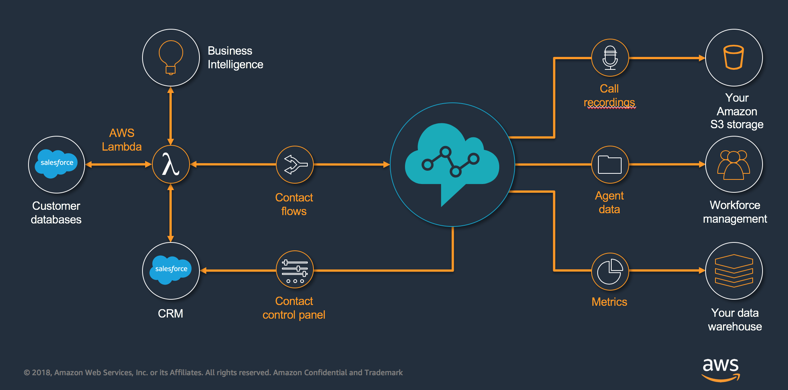

# Amazon Connect Salesforce Lambda

The core functionality of the Amazon Connect CTI Adapter provides a WebRTC browser-based Contact Control Panel (CCP) within Salesforce. The Amazon Connect CTI integration consists of two components, a managed [Salesforce package](https://appexchange.salesforce.com/listingDetail?listingId=a0N3A00000EJH4yUAH) and an [AWS Serverless application](https://serverlessrepo.aws.amazon.com/applications/arn:aws:serverlessrepo:us-west-2:821825267871:applications~AmazonConnectSalesforceLambda), which can be deployed to your AWS environment. 

With those components, customers can build a deep integration between the Amazon Connect contact center platform and Salesforce, the leading customer relationship management (CRM) platform. The collection of pre-build utilities enables a rapid integration between these two platforms. The AWS Serverless application package contains a set of common Lambda functions to be used by Amazon Connect to interact with Salesforce, allowing lookup, create and update operations for different Salesforce objects, like Contacts and Cases.

The key benefits of the adapter:
* Agent state synchronization between Salesforce Omni and Amazon Connect
* Provide valuable information to the agent through configurable view of call attributes
* Utilize the Amazon Connect Call Campaign Object for automated outbound dialling
* Automatically create phone call tasks and relate it to the right Salesforce object
* Embed Amazon Connect Call Recordings in the Salesforce record
* Automatically clean-up open tabs to improve agent efficiency
* Support Salesforce Sales and Service Console in Classic and Lightening
* Amazon Connect CTR import
* Amazon Connect Realtime Queue metrics
* Amazon Connect Post-call transcription

## Requirements

| Name | Version |
|------|---------|
|  [terraform](#requirement\_terraform) | >= 1.0.0 |

## Providers

| Name | Version |
|------|---------|
|  [archive](#provider\_archive) | 2.2.0 |
|  [aws](#provider\_aws) | 3.50.0 |

## Modules

No modules.

## Resources

| Name | Type |
|------|------|
| [aws_cloudfront_distribution.audio_recording_streaming_distribution](https://registry.terraform.io/providers/hashicorp/aws/latest/docs/resources/cloudfront_distribution) | resource |
| [aws_cloudwatch_event_rule.realtime_queue_metrics_cron](https://registry.terraform.io/providers/hashicorp/aws/latest/docs/resources/cloudwatch_event_rule) | resource |
| [aws_cloudwatch_event_target.step-function-state-machine](https://registry.terraform.io/providers/hashicorp/aws/latest/docs/resources/cloudwatch_event_target) | resource |
| [aws_lambda_event_source_mapping.ctr_event_source_mapping](https://registry.terraform.io/providers/hashicorp/aws/latest/docs/resources/lambda_event_source_mapping) | resource |
| [aws_lambda_function.contacttrace_record_lambda](https://registry.terraform.io/providers/hashicorp/aws/latest/docs/resources/lambda_function) | resource |
| [aws_lambda_function.ctr_trigger_lambda](https://registry.terraform.io/providers/hashicorp/aws/latest/docs/resources/lambda_function) | resource |
| [aws_lambda_function.execute_aws_service_lambda](https://registry.terraform.io/providers/hashicorp/aws/latest/docs/resources/lambda_function) | resource |
| [aws_lambda_function.execute_transcription_state_machine_lambda](https://registry.terraform.io/providers/hashicorp/aws/latest/docs/resources/lambda_function) | resource |
| [aws_lambda_function.generate_audio_recording_streaming_url_lambda](https://registry.terraform.io/providers/hashicorp/aws/latest/docs/resources/lambda_function) | resource |
| [aws_lambda_function.get_transcibe_job_status_lambda](https://registry.terraform.io/providers/hashicorp/aws/latest/docs/resources/lambda_function) | resource |
| [aws_lambda_function.interval_agent_lambda](https://registry.terraform.io/providers/hashicorp/aws/latest/docs/resources/lambda_function) | resource |
| [aws_lambda_function.interval_queue_lambda](https://registry.terraform.io/providers/hashicorp/aws/latest/docs/resources/lambda_function) | resource |
| [aws_lambda_function.invoke_api_lambda](https://registry.terraform.io/providers/hashicorp/aws/latest/docs/resources/lambda_function) | resource |
| [aws_lambda_function.process_contact_lens_lambda](https://registry.terraform.io/providers/hashicorp/aws/latest/docs/resources/lambda_function) | resource |
| [aws_lambda_function.process_transcription_result_lambda](https://registry.terraform.io/providers/hashicorp/aws/latest/docs/resources/lambda_function) | resource |
| [aws_lambda_function.realtime_queue_metrics_lambda](https://registry.terraform.io/providers/hashicorp/aws/latest/docs/resources/lambda_function) | resource |
| [aws_lambda_function.realtime_queue_metrics_loop_job_lambda](https://registry.terraform.io/providers/hashicorp/aws/latest/docs/resources/lambda_function) | resource |
| [aws_lambda_function.submit_transcibe_job_lambda](https://registry.terraform.io/providers/hashicorp/aws/latest/docs/resources/lambda_function) | resource |
| [aws_lambda_layer_version.sf_lambda_layer](https://registry.terraform.io/providers/hashicorp/aws/latest/docs/resources/lambda_layer_version) | resource |
| [aws_sfn_state_machine.realtime_queue_metrics_loop_job_state_machine](https://registry.terraform.io/providers/hashicorp/aws/latest/docs/resources/sfn_state_machine) | resource |
| [aws_sfn_state_machine.transcribe_state_machine](https://registry.terraform.io/providers/hashicorp/aws/latest/docs/resources/sfn_state_machine) | resource |
| [archive_file.contacttrace_record_lambda_package](https://registry.terraform.io/providers/hashicorp/archive/latest/docs/data-sources/file) | data source |
| [archive_file.ctr_trigger_lambda_package](https://registry.terraform.io/providers/hashicorp/archive/latest/docs/data-sources/file) | data source |
| [archive_file.execute_aws_service_lambda_package](https://registry.terraform.io/providers/hashicorp/archive/latest/docs/data-sources/file) | data source |
| [archive_file.execute_transcription_state_machine_lambda_package](https://registry.terraform.io/providers/hashicorp/archive/latest/docs/data-sources/file) | data source |
| [archive_file.generate_audio_recording_streaming_url_lambda_package](https://registry.terraform.io/providers/hashicorp/archive/latest/docs/data-sources/file) | data source |
| [archive_file.get_transcibe_job_status_lambda_package](https://registry.terraform.io/providers/hashicorp/archive/latest/docs/data-sources/file) | data source |
| [archive_file.interval_agent_lambda_package](https://registry.terraform.io/providers/hashicorp/archive/latest/docs/data-sources/file) | data source |
| [archive_file.interval_queue_lambda_package](https://registry.terraform.io/providers/hashicorp/archive/latest/docs/data-sources/file) | data source |
| [archive_file.invoke_api_lambda_package](https://registry.terraform.io/providers/hashicorp/archive/latest/docs/data-sources/file) | data source |
| [archive_file.process_contact_lens_lambda_package](https://registry.terraform.io/providers/hashicorp/archive/latest/docs/data-sources/file) | data source |
| [archive_file.process_transcription_result_lambda_package](https://registry.terraform.io/providers/hashicorp/archive/latest/docs/data-sources/file) | data source |
| [archive_file.realtime_queue_metrics_lambda_package](https://registry.terraform.io/providers/hashicorp/archive/latest/docs/data-sources/file) | data source |
| [archive_file.realtime_queue_metrics_loop_job_lambda_package](https://registry.terraform.io/providers/hashicorp/archive/latest/docs/data-sources/file) | data source |
| [archive_file.submit_transcibe_job_lambda_package](https://registry.terraform.io/providers/hashicorp/archive/latest/docs/data-sources/file) | data source |
| [aws_caller_identity.current](https://registry.terraform.io/providers/hashicorp/aws/latest/docs/data-sources/caller_identity) | data source |
| [aws_cloudfront_distribution.audio_recording_streaming_distribution](https://registry.terraform.io/providers/hashicorp/aws/latest/docs/data-sources/cloudfront_distribution) | data source |
| [aws_lambda_function.get_transcibe_job_status_lambda](https://registry.terraform.io/providers/hashicorp/aws/latest/docs/data-sources/lambda_function) | data source |
| [aws_lambda_function.process_transcription_result_lambda](https://registry.terraform.io/providers/hashicorp/aws/latest/docs/data-sources/lambda_function) | data source |
| [aws_lambda_function.realtime_queue_metrics_loop_job_lambda](https://registry.terraform.io/providers/hashicorp/aws/latest/docs/data-sources/lambda_function) | data source |
| [aws_lambda_function.submit_transcibe_job_lambda](https://registry.terraform.io/providers/hashicorp/aws/latest/docs/data-sources/lambda_function) | data source |
| [aws_region.current](https://registry.terraform.io/providers/hashicorp/aws/latest/docs/data-sources/region) | data source |
| [aws_sfn_state_machine.realtime_queue_metrics_loop_job_state_machine](https://registry.terraform.io/providers/hashicorp/aws/latest/docs/data-sources/sfn_state_machine) | data source |
| [aws_sfn_state_machine.transcribe_state_machine](https://registry.terraform.io/providers/hashicorp/aws/latest/docs/data-sources/sfn_state_machine) | data source |

## Inputs

| Name | Description | Type | Default | Required |
|------|-------------|------|---------|:--------:|
|  [AmazonConnectInstanceId](#input\_AmazonConnectInstanceId) | Enter Amazon Connect Instance Id, the string after the last / in your Amazon Connect instance ARN (aaaaaaaa-bbbb-cccc-dddd-eeeeeeeeeeee). Not required if RealtimeReportingImportEnabled is set to false. | `string` | n/a | yes |
|  [AmazonConnectQueueMaxRecords](#input\_AmazonConnectQueueMaxRecords) | Enter record set size for list queue query. Max is 100. | `number` | `100` | no |
|  [AmazonConnectQueueMetricsMaxRecords](#input\_AmazonConnectQueueMetricsMaxRecords) | Enter record set size for queue metrics query. Max is 100. | `number` | `100` | no |
|  [CTREventSourceMappingMaximumRetryAttempts](#input\_CTREventSourceMappingMaximumRetryAttempts) | Maximum retry attempts on failure for lambdas triggered by Kinesis Events | `number` | `100` | no |
|  [CTRKinesisARN](#input\_CTRKinesisARN) | Enter Kinesis Stream ARN for CTR. Not required if PostcallCTRImportEnabled, PostcallRecordingImportEnabled and PostcallTranscribeEnabled all set to false | `string` | `""` | no |
|  [ConnectRecordingS3BucketName](#input\_ConnectRecordingS3BucketName) | This is the S3 bucket where Amazon Connect stores call recordings. Please refer to http://docs.aws.amazon.com/connect/latest/adminguide/amazon-connect-instance.html#datastorage for details on how retrieve the S3 bucket associated with your Amazon Connect instance. Not required if both PostcallRecordingImportEnabled and PostcallTranscribeEnabled set to false. | `string` | n/a | yes |
|  [ConnectReportingS3BucketName](#input\_ConnectReportingS3BucketName) | This is the S3 bucket where Amazon Connect stores scheduled reports. Please refer to http://docs.aws.amazon.com/connect/latest/adminguide/amazon-connect-instance.html#datastorage for details on how retrieve the S3 bucket associated with your Amazon Connect instance. Not required if HistoricalReportingImportEnabled set to false. | `string` | n/a | yes |
|  [ContactLensImportEnabled](#input\_ContactLensImportEnabled) | Set to false if importing Contact Lens into Salesforce should not be enabled. | `string` | n/a | yes |
|  [HistoricalReportingImportEnabled](#input\_HistoricalReportingImportEnabled) | Set to false if importing Historical Reporting into Salesforce should not be enabled. | `string` | n/a | yes |
|  [LambdaLoggingLevel](#input\_LambdaLoggingLevel) | Logging level for Lambda functions. Set one of the following DEBUG \| INFO \| WARNING \| ERROR \| CRITICAL | `string` | `"INFO"` | no |
|  [PostcallCTRImportEnabled](#input\_PostcallCTRImportEnabled) | Set to false if importing CTRs into Salesforce should not be enabled on the package level. | `string` | n/a | yes |
|  [PostcallRecordingImportEnabled](#input\_PostcallRecordingImportEnabled) | Set to false if importing call recordings into Salesforce should not be enabled on the package level. See installation guide for setup details. | `string` | n/a | yes |
|  [PostcallTranscribeEnabled](#input\_PostcallTranscribeEnabled) | Set to false if post-call transcription should not be enabled on the package level. See installation guide for setup details. | `string` | n/a | yes |
|  [PrivateVpcEnabled](#input\_PrivateVpcEnabled) | Set to true if functions should be deployed to a private VPC, set VpcSecurityGroupList and VpcSubnetList if true | `string` | n/a | yes |
|  [RealtimeReportingImportEnabled](#input\_RealtimeReportingImportEnabled) | Set to false if importing Realtime Reporting into Salesforce should not be enabled. | `string` | n/a | yes |
|  [SalesforceAdapterNamespace](#input\_SalesforceAdapterNamespace) | This is the namespace for CTI Adapter managed package. The default value is [amazonconnect]. If a non-managed package is used, leave this field blank. | `string` | `"amazonconnect"` | no |
|  [SalesforceCredentialsKMSKeyARN](#input\_SalesforceCredentialsKMSKeyARN) | Enter the ARN for the Salesforce Credentials KMS Key. This field is required. | `string` | n/a | yes |
|  [SalesforceCredentialsSecretsManagerARN](#input\_SalesforceCredentialsSecretsManagerARN) | Enter the ARN for the Salesforce Credentials Secret in AWS Secrets Manager. This field is required. | `string` | n/a | yes |
|  [SalesforceHost](#input\_SalesforceHost) | Your Salesforce Host. Please make sure the host url starts with "https". | `string` | n/a | yes |
|  [SalesforceProduction](#input\_SalesforceProduction) | True for Production Environment, False for Sandbox | `string` | `"true"` | no |
|  [SalesforceUsername](#input\_SalesforceUsername) | The username of a valid Salesforce API account for your environment. For example, user@domain.com | `string` | n/a | yes |
|  [SalesforceVersion](#input\_SalesforceVersion) | To find the Salesforce Edition and API Version please visit https://help.salesforce.com/articleView?id=000199268&type=1 | `string` | `"v42.0"` | no |
|  [TranscribeOutputS3BucketName](#input\_TranscribeOutputS3BucketName) | This is the S3 bucket where Amazon Transcribe stores the output. If you don't specify an encryption key, the output of the transcription job is encrypted with the default Amazon S3 key (SSE-S3).Not required if both PostcallRecordingImportEnabled and PostcallTranscribeEnabled set to false. | `string` | n/a | yes |
|  [TranscriptionJobCheckWaitTime](#input\_TranscriptionJobCheckWaitTime) | Time between transcription job checks | `number` | `20` | no |
|  [VpcSecurityGroupList](#input\_VpcSecurityGroupList) | The list of SecurityGroupIds for the Virtual Private Cloud (VPC). Not required if PrivateVpcEnabled is set to false. | `list(string)` | n/a | yes |
|  [VpcSubnetList](#input\_VpcSubnetList) | The list of Subnets for the Virtual Private Cloud (VPC). Not required if PrivateVpcEnabled is set to false. | `list(string)` | n/a | yes |

## Outputs

No outputs.